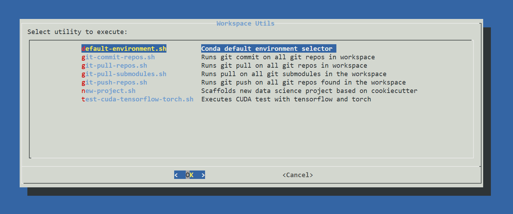

# JupyterLab for Data Science Platform


**Miniforge 3 + JupyterLab 4 for Data Science + TensorFlow (with GPU support) + Torch (with GPU support)**

This project provides a pre-configured JupyterLab environment running on Miniforge with NVIDIA GPU support. It includes a curated base environment with data science packages, plus on-demand installation of TensorFlow, PyTorch, R, and Rust environments, allowing you to start your data science projects with ease.

All services run behind **Traefik** reverse proxy, enabling multiple environments without port collisions. Services are available via distinct URLs:

 - **JupyterLab:** [https://localhost/stellars-jupyterlab-ds/jupyterlab](https://localhost/stellars-jupyterlab-ds/jupyterlab)
 - **MLFlow:** [https://localhost/stellars-jupyterlab-ds/mlflow](https://localhost/stellars-jupyterlab-ds/mlflow)
 - **TensorBoard:** [https://localhost/stellars-jupyterlab-ds/tensorboard](https://localhost/stellars-jupyterlab-ds/tensorboard)
 - **Glances:** [https://localhost/stellars-jupyterlab-ds/glances](https://localhost/stellars-jupyterlab-ds/glances)
 - **Optuna:** [https://localhost/stellars-jupyterlab-ds/optuna](https://localhost/stellars-jupyterlab-ds/optuna) (when running)
 - **Traefik Dashboard:** [http://localhost:8080/dashboard](http://localhost:8080/dashboard)

Note: URLs use the project name from `.env` file (`COMPOSE_PROJECT_NAME`). Default is `stellars-jupyterlab-ds`

This platform integrates with **[stellars-jupyterhub-ds](https://github.com/stellarshenson/stellars-jupyterhub-ds)** for true multi-user environment management with authentication and user administration


## Quickstart

Preferred method for running the container is with **docker compose** or **make**

### Using Make

```bash
make pull   # Pull latest image from Docker Hub
make start  # Start the platform
make help   # Show all available commands
```

### Docker Compose

**Without GPU:**
```bash
docker compose up
```

**With GPU (NVIDIA):**
```bash
docker compose -f compose.yml -f compose-gpu.yml up
```

After starting, open https://localhost/stellars-jupyterlab-ds/jupyterlab in your browser

### Multi User Deployment

#### Jupyterhub

[Stellars Jupyterhub DS](https://github.com/stellarshenson/stellars-jupyterhub-ds) - true multi user environment management

Another **Jupyterhub** based project **https://github.com/stellarshenson/stellars-jupyterhub-ds** introduces true, configurable multi-user environmnet where users can be created, managed and authorised in a way that is both convenient for individual environments as well as with the corporate multi-user access policies. Please consult the project for details

#### Standalone launcher

Convenient launcher scripts for multi-user platform are available in the `multi-user/` directory:
- `start_lab_user.sh` - script that launches new environment for a new user
- `stop_lab_user.sh` - script that shuts user's environment down

### Docker (Standalone)

You can run the container without Traefik reverse proxy using plain Docker. Note that this approach bypasses the URL-based routing and exposes JupyterLab directly on port 8888.

**Without GPU support:**
```bash
docker run -p 8888:8888 \
 -v stellars-jupyterlab-ds_home:/home \
 -v stellars-jupyterlab-ds_workspace:/home/lab/workspace \
 -v stellars-jupyterlab-ds_certs:/mnt/certs \
 -e JUPYTERLAB_BASE_URL=/lab \
 --name lab \
 --hostname lab \
 stellars/stellars-jupyterlab-ds:latest
```

**With GPU support (NVIDIA):**
```bash
docker run -p 8888:8888 \
 -v stellars-jupyterlab-ds_home:/home \
 -v stellars-jupyterlab-ds_workspace:/home/lab/workspace \
 -v stellars-jupyterlab-ds_certs:/mnt/certs \
 -e ENABLE_GPU_SUPPORT=1 \
 -e JUPYTERLAB_BASE_URL=/lab \
 --gpus all \
 --name lab-gpu \
 --hostname lab-gpu \
 stellars/stellars-jupyterlab-ds:latest
```

Then open https://localhost:8888/lab in your browser

## Key Features

### Architecture
- **Traefik Reverse Proxy:** All services run behind Traefik, enabling multiple environments without port conflicts
- **Watchtower:** Automatic container updates (runs daily at midnight)
- **Named Volumes:** Persistent data for workspace, home directory, cache, and certificates

### JupyterLab Extensions
- Conda environment and package management from within JupyterLab
- Multiple kernel support for different environments
- Git integration for version control operations
- Language Server Protocol with intelligent autocompletion and documentation
- Code formatting integration supporting multiple formatters
- Real-time CPU and memory usage monitoring
- Cell execution time tracking
- Favorites sidebar for quick navigation to frequently used locations
- Embedded web browser for viewing external content in iframes
- Custom launcher buttons for integrated services
- Archive management for compressing and extracting files
- GitHub Copilot integration for AI-assisted coding
- Jupytext support for version-controlling notebooks as plain Python files
- Notebook export to multiple formats including HTML and PDF

### Integrated Services
- **TensorBoard:** Visualization and monitoring of ML/AI model training metrics (port 6006, logs in `/tmp/tensorboard`)
- **MLFlow:** Experiment tracking, model registry, and MLOps suite (port 5000)
- **Glances:** Real-time system monitoring including CPU, memory, disk, network, and GPU metrics (port 61208)
- **Optuna:** Hyperparameter optimization dashboard (port 8080, when running)
- **Jupyter Server Proxy:** Advanced proxy for additional services when running in hub mode

### Conda Environments

**Base Environment (Pre-installed):**
- Python 3.12 with comprehensive data science stack
- Core libraries: NumPy, Pandas, Polars, Matplotlib, Scikit-learn, SciPy
- MLOps tools: MLFlow for experiment tracking, TensorBoard for training visualization
- Development tools: Black formatter, Make build tools, Pip-tools
- Environment management: Python-dotenv for configuration
- Data formats: Parquet-tools for columnar data inspection
- GPU monitoring: nvtop for NVIDIA GPU status

**Additional Environments (On-Demand Installation):**

Use `workspace-utils.sh` > "Install Conda Environments" to install additional environments:

**TensorFlow Environment:**
- TensorFlow 2.18+ with CUDA GPU acceleration support
- Optimized for deep learning and neural network training

**PyTorch Environment:**
- PyTorch 2.4+ with GPU support
- Prepared for YOLO and computer vision workloads

**R Environment:**
- R language kernel for statistical computing
- Integrated with Jupyter for mixed-language workflows

**Rust Environment:**
- Rust compiler and toolchain
- evcxr Jupyter kernel for running Rust code in notebooks

For a complete list of installed packages, refer to the [configuration files](https://github.com/stellarshenson/stellars-jupyterlab-ds/tree/main/services/jupyterlab/conf)

## About the Author
**Name:** Konrad Jelen (aka Stellars Henson)  
**Email:** konrad.jelen+github@gmail.com  
**LinkedIn:** [Konrad Jelen](https://www.linkedin.com/in/konradjelen/)

Entrepreneur, enterprise architect, and data science/machine learning practitioner with extensive software development and product management experience. Previously an experimental physicist with a strong background in physics, electronics, manufacturing, and science.

## Installation

To use this environment, Docker must be installed on your system. JupyterLab 4 is provided as a Docker container, ensuring complete isolation from your system's software.

**Docker Hub Repository:** [Stellars JupyterLab DS](https://hub.docker.com/repository/docker/stellars/stellars-jupyterlab-ds/general)

### Required Software
1. [Docker Desktop](https://www.docker.com/products/docker-desktop/) - includes `docker compose` command
2. (Optional) GNU Make - for convenient command execution

### Quick Start Commands

**Using Make (recommended):**
```bash
make pull   # Pull latest image from Docker Hub
make start  # Start the platform
make build  # Build locally (takes ~1.5 hours)
make clean  # Clean up containers and dangling images
```

**Using Docker Compose:**
```bash
# Pull latest image
docker compose pull

# Start without GPU
docker compose up

# Start with GPU support
docker compose -f compose.yml -f compose-gpu.yml up

# Build locally (optional)
docker compose build
```

**Using convenience scripts:**
```bash
# Linux/Mac
./start.sh              # Start without GPU
./scripts/start.sh      # Alternative location

# Windows
start.bat               # Start without GPU
scripts\start.bat       # Alternative location
```

### Configuration
- Set `CONDA_DEFAULT_ENV` in `compose.yml` or in `~/.profile` to specify default conda environment
- Customize project name and token in `.env` file
- Project name defaults to `stellars-jupyterlab-ds` and determines URL paths

### Available Make Commands
```bash
make help           # Show all available commands
make pull           # Pull latest image from Docker Hub
make build          # Build container locally
make build_verbose  # Build with detailed output
make start          # Start the platform
make push           # Push images to Docker Hub (requires authentication)
make tag            # Tag image with git version
make clean          # Remove containers and clean up unused resources
``` 

## Default Settings
- **Work Directory:** `~/workspace` (mounted as `vol_workspace`)
- **Home Directory:** `/home/lab` (mounted as `vol_home`, contains user settings)
- **JupyterLab Settings:** Stored in `/home/lab/.jupyter`
- **Root Access:** Available via `sudo` (password: `password`)
- **TensorBoard Logs:** `/tmp/tensorboard`
- **Default User:** `lab`
- **Network:** `traefik-network` (bridge driver)

### Volume Persistence
All volumes are named and persist across container updates:
- `vol_workspace` - your projects and notebooks
- `vol_home` - user settings and configurations
- `vol_cache` - cached computation results
- `vol_certs` - TLS certificates for HTTPS

### Repository Structure
```
.
├── compose.yml              # Main docker compose configuration
├── compose-gpu.yml          # GPU support overlay
├── .env                     # Project configuration (name, tokens)
├── Makefile                 # Convenient build/run commands
├── start.sh / start.bat     # Quick start scripts
├── services/
│   └── jupyterlab/          # JupyterLab container configuration
│       ├── Dockerfile.jupyterlab
│       └── conf/            # Environment configs, packages
├── scripts/                 # Build and start helper scripts
├── multi-user/              # Multi-user deployment scripts
└── extra/                   # Additional configurations (AWS, CVAT, etc.)
```

## Workspace Utilities

System implements number of helpful _Workspace Utilities_ to support streamlined development and to help with everyday tasks. 

`workspace-utils.sh` script available in the user's workspace provides a convenient visual dialog for launching of the different utils along with a short description of what they are used for



### Environment Variables

Configuration variables supported by the platform:

**Core Configuration:**
- `COMPOSE_PROJECT_NAME` - project name (used for container names, volumes, and URL paths)
- `LAB_USER` - username identifier (default: `default`)
- `LAB_NAME` - lab instance name (defaults to `COMPOSE_PROJECT_NAME`)

**JupyterLab Settings:**
- `CONDA_DEFAULT_ENV` - default conda environment to activate (default: `base`)
- `JUPYTERLAB_SERVER_IP` - IP address for JupyterLab (default: `*` for all interfaces)
- `JUPYTERLAB_SERVER_TOKEN` - access token (empty = no password required)
- `JUPYTERLAB_BASE_URL` - base URL path (default: `/${COMPOSE_PROJECT_NAME}/jupyterlab`)

**Service Toggles:**
- `ENABLE_GPU_SUPPORT` - enable NVIDIA GPU support (default: `0`)
- `ENABLE_GPUSTAT` - enable GPU monitoring
- `ENABLE_SERVICE_MLFLOW` - enable MLFlow service (default: `1`)
- `ENABLE_SERVICE_GLANCES` - enable Glances monitoring (default: `1`)
- `ENABLE_SERVICE_TENSORBOARD` - enable TensorBoard (default: `1`)
- `ENABLE_LOCAL_SCRIPTS` - enable user-defined startup scripts

**Service Configuration:**
- `TF_CPP_MIN_LOG_LEVEL` - TensorFlow logging level (default: `3` for errors only)
- `TENSORBOARD_LOGDIR` - TensorBoard log directory (default: `/tmp/tensorboard`)
- `MLFLOW_TRACKING_URI` - MLFlow tracking URI (default: `http://localhost:5000`)
- `MLFLOW_PORT` - MLFlow service port (default: `5000`)
- `MLFLOW_HOST` - MLFlow bind address (default: `*`)
- `MLFLOW_WORKERS` - MLFlow worker count (default: `1`)


## Additional Platform Features

**Development Environment:**
- JupyterLab 4+ with Git integration, intelligent autocompletion, and resource monitoring
- On-demand conda environments for TensorFlow, PyTorch, R, Rust, and general data science
- Code formatting with Black and other formatters integrated into the IDE
- Notebook diffing and merging tools for version control
- Cookiecutter templates for standardized project structure
- Enhanced terminal with Midnight Commander and standard Unix tools

**Data Science Stack:**
- Core libraries: NumPy, Pandas, Polars for high-performance data manipulation
- Machine learning: Scikit-learn, MLFlow for experiment tracking
- Visualization: Matplotlib for plotting and charting
- Scientific computing: SciPy for advanced mathematical operations
- Data formats: Parquet-tools for columnar data inspection

**Deep Learning:**
- TensorFlow 2.18+ with CUDA GPU acceleration
- PyTorch 2.4+ with GPU support
- TensorBoard for training visualization and metrics tracking

**System Monitoring:**
- Real-time GPU monitoring with nvtop and gpustat
- Glances web interface for comprehensive system metrics
- Built-in resource usage monitoring in JupyterLab
- NVIDIA ML Python bindings for programmatic GPU access

**User Experience:**
- Custom IntelliJ-inspired dark themes (Darcula and Sublime variants)
- Workspace utilities helper scripts for common tasks
- Favorites sidebar for quick navigation
- Cell execution time tracking
- Automatic container updates via Watchtower
- Self-signed TLS certificates for HTTPS access

<!-- EOF -->

