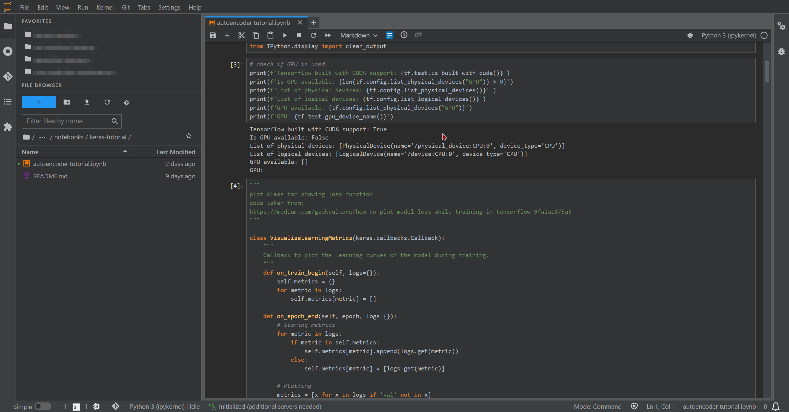
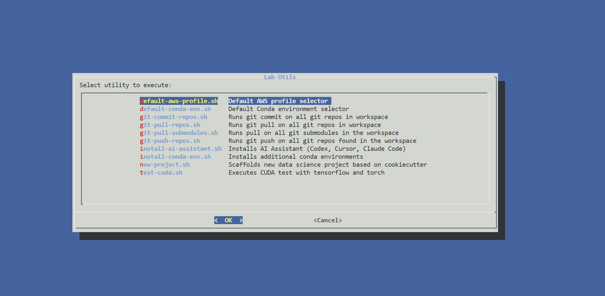
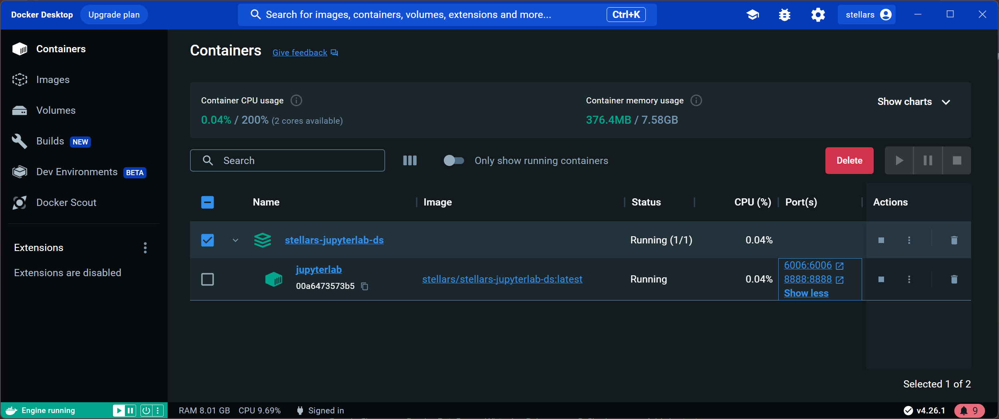
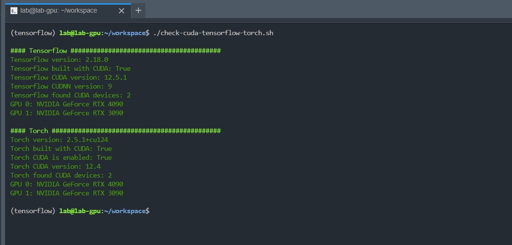
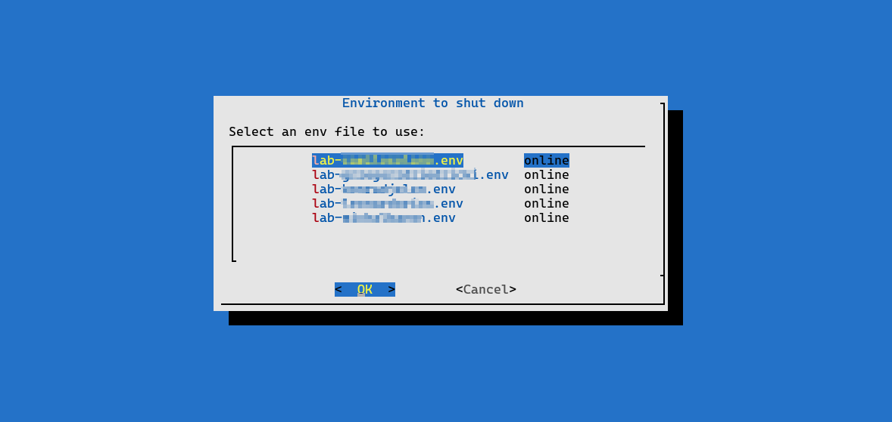
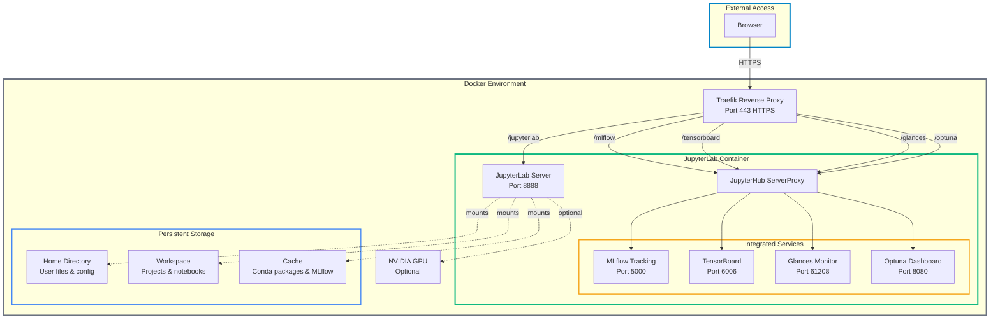
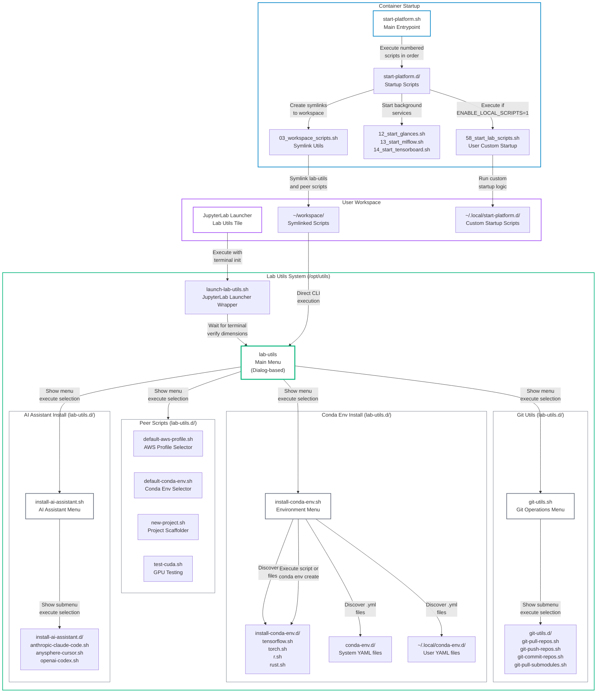

# JupyterLab for Data Science Platform


**Miniforge 3 + JupyterLab 4 for Data Science with On-Demand TensorFlow and PyTorch (GPU support)**

This project provides a pre-configured JupyterLab environment running on Miniforge with NVIDIA GPU support. It includes a curated base environment with data science packages, plus on-demand installation of TensorFlow, PyTorch, R, and Rust environments, allowing you to start your data science projects with ease.

All services run behind **Traefik** reverse proxy, enabling multiple environments without port collisions. Services are available via distinct URLs:

 - **JupyterLab:** [https://localhost/stellars-jupyterlab-ds/jupyterlab](https://localhost/stellars-jupyterlab-ds/jupyterlab)
 - **MLFlow:** [https://localhost/stellars-jupyterlab-ds/mlflow](https://localhost/stellars-jupyterlab-ds/mlflow)
 - **TensorBoard:** [https://localhost/stellars-jupyterlab-ds/tensorboard](https://localhost/stellars-jupyterlab-ds/tensorboard)
 - **Glances:** [https://localhost/stellars-jupyterlab-ds/glances](https://localhost/stellars-jupyterlab-ds/glances)
 - **Optuna:** [https://localhost/stellars-jupyterlab-ds/optuna](https://localhost/stellars-jupyterlab-ds/optuna) (when running)
 - **Traefik Dashboard:** [http://localhost:8080/dashboard](http://localhost:8080/dashboard)

Note: URLs use the project name from `.env` file (`COMPOSE_PROJECT_NAME`). Default is `stellars-jupyterlab-ds`

This platform integrates with **[stellars-jupyterhub-ds](https://github.com/stellarshenson/stellars-jupyterhub-ds)** for true multi-user environment management with authentication and user administration









## Getting Started

The platform offers multiple deployment options depending on your needs. For production multi-user environments, JupyterHub integration provides the best experience with full user management, authentication, and resource allocation. Single-user deployments work well with the convenience scripts or docker compose.

### Recommended: JupyterHub Multi-User Deployment

The [stellars-jupyterhub-ds](https://github.com/stellarshenson/stellars-jupyterhub-ds) project provides enterprise-grade multi-user JupyterLab deployment with user authentication, session management, and resource controls. This integration enables hub-level features like broadcast notifications, centralized user administration, and quota management. Each user gets an isolated JupyterLab environment with dedicated workspace and home directory.

**Key benefits:**
- User authentication and authorization
- Per-user resource limits and quotas
- Centralized administration and monitoring
- Broadcast notification system
- Seamless integration with corporate identity providers

Visit the [stellars-jupyterhub-ds repository](https://github.com/stellarshenson/stellars-jupyterhub-ds) for deployment instructions and configuration details.

### Quick Launch Scripts

The simplest way to launch a single-user environment is using the included launcher scripts. These scripts automatically detect GPU availability and configure the appropriate docker compose settings.

**Linux/macOS:**
```bash
./start.sh
```

**Windows:**
```cmd
start.bat
```

The launcher detects NVIDIA GPU via `nvidia-smi` and automatically launches with GPU support when available. After starting, access JupyterLab at https://localhost/stellars-jupyterlab-ds/jupyterlab

### Docker Compose

For manual control over the deployment configuration, use docker compose directly. This approach requires specifying GPU configuration explicitly when needed.

**Without GPU:**
```bash
docker compose up
```

**With NVIDIA GPU:**
```bash
docker compose -f compose.yml -f compose-gpu.yml up
```

Access the platform at https://localhost/stellars-jupyterlab-ds/jupyterlab once containers are running.

### Multi-User Standalone Scripts

For running multiple single-user instances without JupyterHub, launcher scripts in the `multi-user/` directory create isolated environments per user:

- `start_lab_user.sh` - Launch new user environment
- `stop_lab_user.sh` - Shutdown user environment

This approach provides basic multi-user support through container isolation without centralized authentication.

## Key Features

### Architecture

The platform uses a containerized architecture with Traefik reverse proxy providing unified access to all services through a single HTTPS endpoint.



**Lab Utils Architecture:**



**Key Components:**
- **Traefik Reverse Proxy:** All services run behind Traefik, enabling multiple environments without port conflicts
- **JupyterHub ServerProxy:** Routes traffic from JupyterLab to integrated services (MLflow, TensorBoard, Glances)
- **Watchtower:** Automatic container updates (runs daily at midnight)
- **Named Volumes:** Persistent data for workspace, home directory, cache, and certificates
- **GPU Support:** Optional NVIDIA GPU access for accelerated computing

### JupyterLab Extensions
- Conda environment and package management from within JupyterLab
- Multiple kernel support for different environments (install additional environments via lab-utils)
- Git integration for version control operations
- Language Server Protocol with intelligent autocompletion and documentation
- Code formatting integration supporting multiple formatters
- Real-time CPU and memory usage monitoring
- Cell execution time tracking
- Favorites sidebar for quick navigation to frequently used locations
- Embedded web browser for viewing external content in iframes
- Custom launcher buttons for integrated services
- Archive management for compressing and extracting files
- GitHub Copilot integration for AI-assisted coding
- Jupytext support for version-controlling notebooks as plain Python files
- Notebook export to multiple formats including HTML and PDF

### Integrated Services
- **TensorBoard:** Visualization and monitoring of ML/AI model training metrics (port 6006, logs in `/tmp/tensorboard`)
- **MLFlow:** Experiment tracking, model registry, and MLOps suite (port 5000)
- **Glances:** Real-time system monitoring including CPU, memory, disk, network, and GPU metrics (port 61208)
- **Optuna:** Hyperparameter optimization dashboard (port 8080, when running)
- **Jupyter Server Proxy:** Advanced proxy for additional services when running in hub mode

### Conda Environments

**Base Environment (Pre-installed):**
- Python 3.12 with comprehensive data science stack
- Core libraries: NumPy, Pandas, Polars, Matplotlib, Scikit-learn, SciPy
- MLOps tools: MLFlow for experiment tracking, TensorBoard for training visualization
- Development tools: Black formatter, Make build tools, Pip-tools
- Environment management: Python-dotenv for configuration
- Data formats: Parquet-tools for columnar data inspection
- GPU monitoring: nvtop for NVIDIA GPU status

**Additional Environments (On-Demand Installation):**

Use `lab-utils` > "Install Conda Environments" to install additional environments:

**TensorFlow Environment:**
- TensorFlow 2.18+ with CUDA GPU acceleration support
- Optimized for deep learning and neural network training

**PyTorch Environment:**
- PyTorch 2.4+ with GPU support
- Prepared for YOLO and computer vision workloads

**R Environment:**
- R language kernel for statistical computing
- Integrated with Jupyter for mixed-language workflows

**Rust Environment:**
- Rust compiler and toolchain
- evcxr Jupyter kernel for running Rust code in notebooks

For a complete list of installed packages, refer to the [configuration files](https://github.com/stellarshenson/stellars-jupyterlab-ds/tree/main/services/jupyterlab/conf)

## About the Author
**Name:** Konrad Jelen (aka Stellars Henson)  
**Email:** konrad.jelen+github@gmail.com  
**LinkedIn:** [Konrad Jelen](https://www.linkedin.com/in/konradjelen/)

Entrepreneur, enterprise architect, and data science/machine learning practitioner with extensive software development and product management experience. Previously an experimental physicist with a strong background in physics, electronics, manufacturing, and science.

## Installation

Docker must be installed on your system to run this platform. JupyterLab 4 runs as a containerized application, ensuring complete isolation from your host system and consistent behavior across different environments.

**Docker Hub Repository:** [stellars/stellars-jupyterlab-ds](https://hub.docker.com/repository/docker/stellars/stellars-jupyterlab-ds/general)

### Prerequisites

Install [Docker Desktop](https://www.docker.com/products/docker-desktop/) which includes the `docker compose` command. For NVIDIA GPU support, install the [NVIDIA Container Toolkit](https://docs.nvidia.com/datacenter/cloud-native/container-toolkit/install-guide.html) to enable GPU pass-through to containers.

### Deployment Options

The platform supports several deployment patterns depending on your use case. For enterprise multi-user environments, JupyterHub integration provides authentication, resource management, and centralized administration. Single-user deployments work well with the quick launch scripts that handle GPU detection automatically.

**Quick Launch (Recommended for single-user):**

The launcher scripts detect NVIDIA GPU availability and configure docker compose appropriately:

```bash
# Linux/macOS
./start.sh

# Windows
start.bat
```

**Docker Compose (Manual configuration):**

Pull the latest image and start with explicit GPU configuration:

```bash
# Pull latest image
docker compose pull

# Without GPU
docker compose up

# With NVIDIA GPU
docker compose -f compose.yml -f compose-gpu.yml up
```

**Build from source (Development):**

For local modifications or development work, build the image locally. Note that building from source takes significantly longer than pulling pre-built images from Docker Hub.

```bash
docker compose build
```

### Configuration

The `.env` file contains core configuration including project name and authentication tokens. The project name determines URL paths for all services - changing from the default `stellars-jupyterlab-ds` requires updating URLs accordingly.

**Key configuration options:**
- `COMPOSE_PROJECT_NAME` - Determines URL paths and container names
- `JUPYTERLAB_SERVER_TOKEN` - Authentication token (empty means no password required)
- `CONDA_DEFAULT_ENV` - Default conda environment (only base is pre-installed)

Set `CONDA_DEFAULT_ENV` in `compose.yml` or `~/.profile` to specify which conda environment loads by default. Additional environments (tensorflow, torch, r_base, rust) install on-demand via lab-utils. 

## Default Settings
- **Work Directory:** `~/workspace` (mounted as `vol_workspace`)
- **Home Directory:** `/home/lab` (mounted as `vol_home`, contains user settings)
- **JupyterLab Settings:** Stored in `/home/lab/.jupyter`
- **Root Access:** Available via `sudo` (password: `password`)
- **TensorBoard Logs:** `/tmp/tensorboard`
- **Default User:** `lab`
- **Network:** `traefik-network` (bridge driver)

### Volume Persistence
All volumes are named and persist across container updates:
- `vol_workspace` - your projects and notebooks
- `vol_home` - user settings and configurations
- `vol_cache` - cached computation results
- `vol_certs` - TLS certificates for HTTPS

### Repository Structure
```
.
├── compose.yml              # Main docker compose configuration
├── compose-gpu.yml          # GPU support overlay
├── .env                     # Project configuration (name, tokens)
├── Makefile                 # Convenient build/run commands
├── start.sh / start.bat     # Quick start scripts
├── services/
│   └── jupyterlab/          # JupyterLab container configuration
│       ├── Dockerfile.jupyterlab
│       └── conf/            # Environment configs, packages
├── scripts/                 # Build and start helper scripts
├── multi-user/              # Multi-user deployment scripts
└── extra/                   # Additional configurations (AWS, CVAT, etc.)
```

## Lab Utilities

System implements number of helpful _Lab Utilities_ to support streamlined development and to help with everyday tasks.

`lab-utils` script available in the user's workspace provides a convenient visual dialog for launching of the different utils along with a short description of what they are used for

### Environment Variables

Configuration variables supported by the platform:

**Core Configuration:**
- `COMPOSE_PROJECT_NAME` - project name (used for container names, volumes, and URL paths)
- `LAB_USER` - username identifier (default: `default`)
- `LAB_NAME` - lab instance name (defaults to `COMPOSE_PROJECT_NAME`)

**JupyterLab Settings:**
- `CONDA_DEFAULT_ENV` - default conda environment to activate (default: `base`)
- `JUPYTERLAB_SERVER_IP` - IP address for JupyterLab (default: `*` for all interfaces)
- `JUPYTERLAB_SERVER_TOKEN` - access token (empty = no password required)
- `JUPYTERLAB_BASE_URL` - base URL path (default: `/${COMPOSE_PROJECT_NAME}/jupyterlab`)

**Service Toggles:**
- `ENABLE_GPU_SUPPORT` - enable NVIDIA GPU support (default: `0`)
- `ENABLE_GPUSTAT` - enable GPU monitoring
- `ENABLE_SERVICE_MLFLOW` - enable MLFlow service (default: `1`)
- `ENABLE_SERVICE_GLANCES` - enable Glances monitoring (default: `1`)
- `ENABLE_SERVICE_TENSORBOARD` - enable TensorBoard (default: `1`)
- `ENABLE_LOCAL_SCRIPTS` - enable user-defined startup scripts

**Service Configuration:**
- `TF_CPP_MIN_LOG_LEVEL` - TensorFlow logging level (default: `3` for errors only)
- `TENSORBOARD_LOGDIR` - TensorBoard log directory (default: `/tmp/tensorboard`)
- `MLFLOW_TRACKING_URI` - MLFlow tracking URI (default: `http://localhost:5000`)
- `MLFLOW_PORT` - MLFlow service port (default: `5000`)
- `MLFLOW_HOST` - MLFlow bind address (default: `*`)
- `MLFLOW_WORKERS` - MLFlow worker count (default: `1`)


## Additional Platform Features

**Development Environment:**
- JupyterLab 4+ with Git integration, intelligent autocompletion, and resource monitoring
- On-demand conda environments for TensorFlow, PyTorch, R, Rust, and general data science
- Code formatting with Black and other formatters integrated into the IDE
- Notebook diffing and merging tools for version control
- Cookiecutter templates for standardized project structure
- Enhanced terminal with Midnight Commander and standard Unix tools

**Data Science Stack:**
- Core libraries: NumPy, Pandas, Polars for high-performance data manipulation
- Machine learning: Scikit-learn, MLFlow for experiment tracking
- Visualization: Matplotlib for plotting and charting
- Scientific computing: SciPy for advanced mathematical operations
- Data formats: Parquet-tools for columnar data inspection

**Deep Learning (On-Demand Installation):**
- TensorFlow 2.18+ with CUDA GPU acceleration (install via lab-utils)
- PyTorch 2.4+ with GPU support (install via lab-utils)
- TensorBoard for training visualization and metrics tracking (pre-installed in base)

**System Monitoring:**
- Real-time GPU monitoring with nvtop and gpustat
- Glances web interface for comprehensive system metrics
- Built-in resource usage monitoring in JupyterLab
- NVIDIA ML Python bindings for programmatic GPU access

**User Experience:**
- Custom IntelliJ-inspired dark themes (Darcula and Sublime variants)
- Lab utilities helper scripts for common tasks
- Favorites sidebar for quick navigation
- Cell execution time tracking
- Automatic container updates via Watchtower
- Self-signed TLS certificates for HTTPS access

<!-- EOF -->

