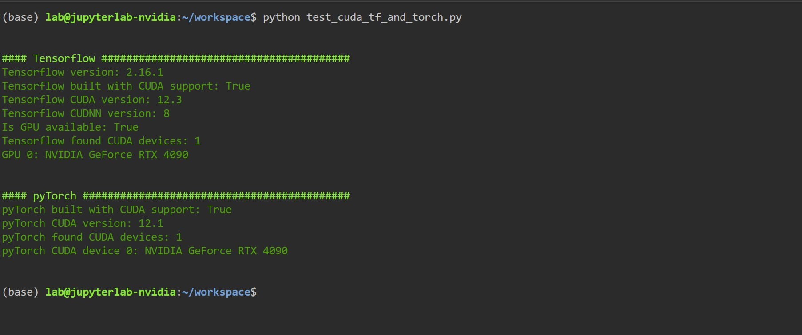

# Jupyterlab for Data Science Platform
Miniforge 3 + Jupyterlab 4 for Data Science + Tensorflow (GPU) + pyTorch(GPU)

This project defines a pre-packaged, pre-configured jupyterlab running over miniconda with nvidia support and 
a list of pre-installed data science packages that would let you run your data science projects in a snap

 

There were many jupyterlab features installed, among them:
- jupyterlab-git extension
- jupyterlab-lsp language servers (python) extension
- autocompletion and code suggests with documentation
- resource usage monitor

There also is a Tensorboard server running on `6006` port and `/tmp/tf_logs` logs directory to help you with your ML/AI development and tensorflow neural nets training monitoring

-----

For complete list of packages, please refer to [packages manifest](https://github.com/stellarshenson/stellars-jupyterlab-ds/blob/main/build/conf/environment.yml). It is frequently updated to promote best tools that can help you with the development

### About me
Name: Konrad Jelen (aka stellars henson) <konrad.jelen+github@gmail.com>  
Linked-in: https://www.linkedin.com/in/konradjelen/

Entreprenour, enterprise architect and data science / machine learning practitioner with vast software development and product management experience. I am also ex experimental physicist with solid physics, electronics, manufacturing and science background. 

### Installation

Installation is dependent on the docker software installed.
Jupyterlab 4 is going to be availabe via container and will
be completely isolated from the rest of the computer's software

Docker hub repository: https://hub.docker.com/repository/docker/stellars/stellars-jupyterlab-ds/general

There will be software required to be installed in order to run this:

1. [docker desktop](https://www.docker.com/products/docker-desktop/) - this software comes with the docker-compose required to run the container
2. `docker-compose` command - comes with the docker-desktop software

### Usage

1. run `docker-compose pull` in the main folder to download the latest container image 
2. (optional) run `docker-compose build` to build the image. Be aware that __building takes approx 1.5h__
3. start container using either default or custom configuration
    - run `docker-compose up` in the main folder to start the standard non-cuda container
    - run `docker-compose -f docker-compose-nvidia.yml up` to start standard cuda container
    - run `docker-compose -f local/your-custom-docker-compose.yml up` to start your custom container
    - ... or use `bin/start*` scripts
4. access https://localhost:8888 to run JupyterLab
5. access http://localhost:6006 to run Tensorboard

**Quick Configuration**

- use `CONDA_DEFAULT_ENV` variable in docker-compose `.yml` files to indicate your default conda env

**Default settings**
- work dir is `/opt/workspace`
- homedir with settings `/root`
- jupyterlab settings are saved to `/root/.jupyter`
- if you use `docker-compose`, ./home and ./workspace are mapped to local `/root` and `/opt/workspace`
    - otherwise system uses base settings from jupyterlab distribution
- you hava access to the local root account
- tensorboard reads logs from `/tmp/tf_logs`
- tensorboard is running on port 6006
- jupyterlabl is running on port 8888
- jupyterlab conda env name is `jupyterlab`

**Tip:** you don't need to run `docker-compose build` if you pull the docker image from the docker hub. When you run `docker-compose up` for the first time docker will find out if you can use prebuilt package 

### Configuration

- **./build** contains container build artefacts, you wouldn't need to look there
- **./.env** contains name of the project - this will be used to name the volumes and the entire compose project

**Tip:** modify the `/opt/workspace` entry in the `volumes:` section of the docker-compose files to map to a different projects location in your filesystem 

### Features
* jupyterlab 4+ (see [jupyterlab homepage](https://jupyterlab.readthedocs.io/en/latest) for reference)
* git, autocomplete and other extensions to jupyterlab
* lsp extensions for python autocompletion
* full set of ML libraries: keras, tensorflow, scikit-learn, scipy, numpy
* full set of DM libraries pandas, polars
* full set of graphs libraries matplotlib, seaborn
* nvidia cuda enabled ML and DM libraries - cupy, cudf and tensorflow with gpu support
* miniconda with nice jupyterlab terminal support
* html and pdf (webpdf) generation support
* memory profiler
* configurable mapping to your filesystem folder that holds your projects
* configurable settings files and folders used in __jupyterlab__, such as AWS credentials, GIT settings and jupyterlab settings, so that when you decide to shred the container and run it anew again, you can be sure your settings were saved
* nice intellij dark theme (medium contrast)
* favourites (useful when you have many projects)
* nice colourful termina + mc and other useful tools
* __tensorboard__ (already configured and running on port 6006)
* tensorflow visualisation extensions

<!-- EOF -->
