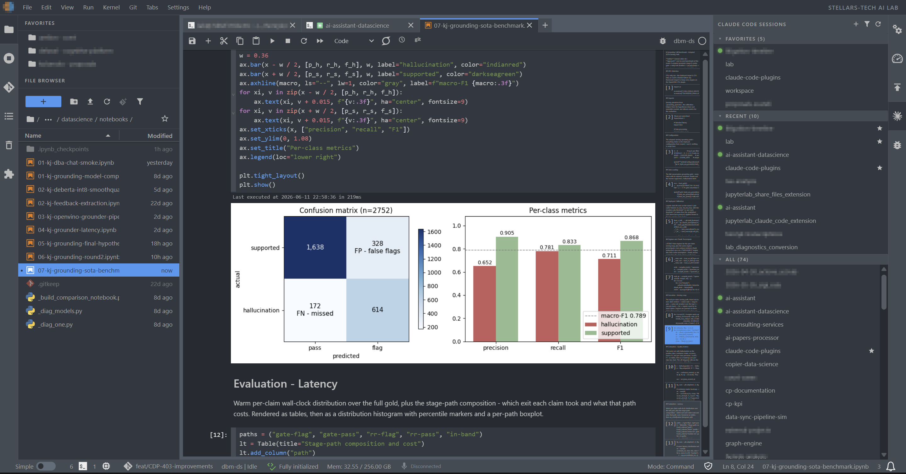
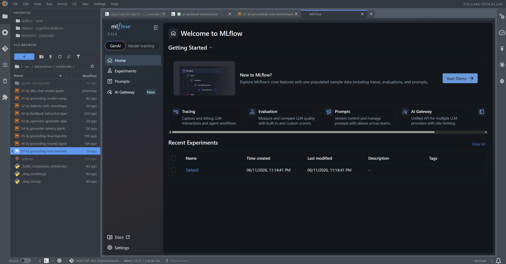
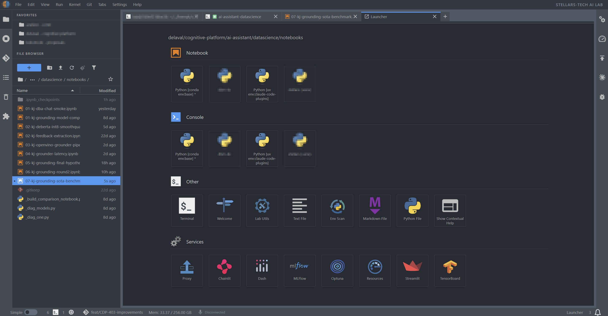
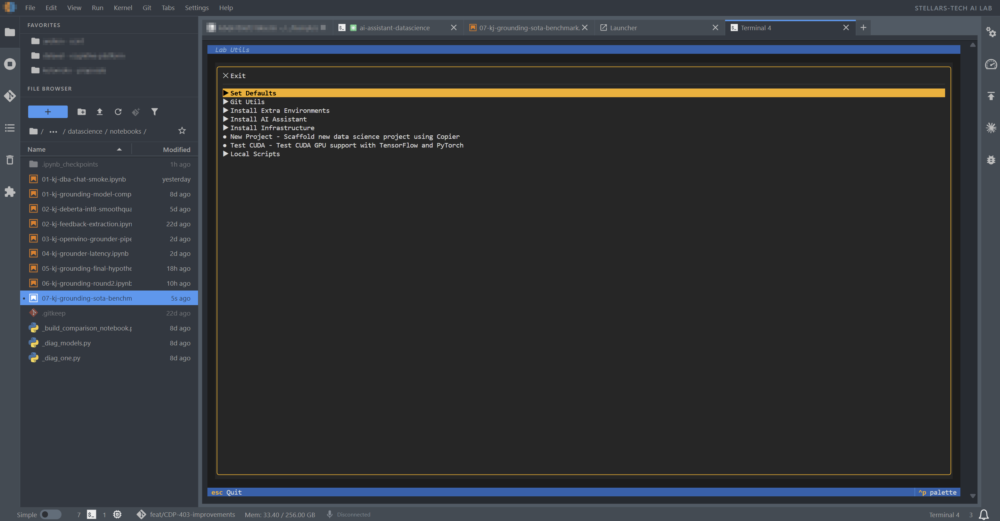
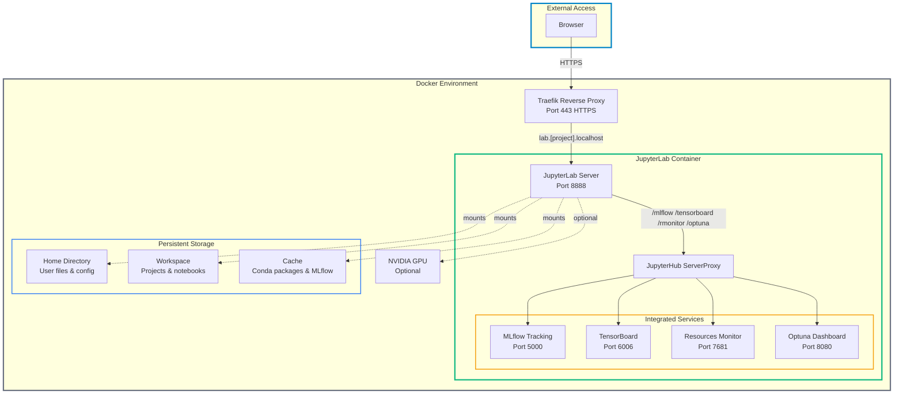

# JupyterLab for Data Science Platform
[](https://github.com/stellarshenson/stellars-jupyterlab-ds/actions/workflows/ci.yml)


[](https://kolomolo.com)
[](https://www.paypal.com/donate/?hosted_button_id=B4KPBJDLLXTSA)

**Miniforge 3 + JupyterLab 4 for Data Science with On-Demand TensorFlow and PyTorch (GPU support)**

This project provides a pre-configured JupyterLab environment running on Miniforge with NVIDIA GPU support. It includes a curated base environment with data science packages, plus on-demand installation of TensorFlow, PyTorch, R, and Rust environments, allowing you to start your data science projects with ease.

All services run behind **Traefik** reverse proxy. Default delivery is now **host-based routing** (previously path-based) - each instance gets its own `*.{project}.localhost` namespace, so many deployments run side by side on one machine (`*.localhost` resolves to 127.0.0.1 in modern browsers, no hosts-file edits):

 - **JupyterLab:** [https://lab.stellars-jupyterlab-ds.localhost](https://lab.stellars-jupyterlab-ds.localhost)
 - **Traefik Dashboard:** [https://traefik.stellars-jupyterlab-ds.localhost](https://traefik.stellars-jupyterlab-ds.localhost)

Note: hosts use the project name from `.env.default` (`COMPOSE_PROJECT_NAME`, override in `.env`). Default is `stellars-jupyterlab-ds`

This platform integrates with **[stellars-jupyterhub-ds](https://github.com/stellarshenson/stellars-jupyterhub-ds)** for true multi-user environment management with authentication and user administration


*JupyterLab running a data science notebook with model evaluation charts*


*MLflow experiment tracking embedded in a JupyterLab tab*


*The launcher with notebook, console, and integrated service tiles*


*The Lab Utils menu for environments, AI assistants, and infrastructure installers*


## Getting Started

The platform offers multiple deployment options depending on your needs. For production multi-user environments, JupyterHub integration provides the best experience with full user management, authentication, and resource allocation. Single-user deployments work well with the convenience scripts or docker compose.

### Recommended: JupyterHub Multi-User Deployment

The [stellars-jupyterhub-ds](https://github.com/stellarshenson/stellars-jupyterhub-ds) project provides enterprise-grade multi-user JupyterLab deployment with user authentication, session management, and resource controls. This integration enables hub-level features like broadcast notifications, centralized user administration, and quota management. Each user gets an isolated JupyterLab environment with dedicated workspace and home directory.

**Key benefits:**
- User authentication and authorization
- Per-user resource limits and quotas
- Centralized administration and monitoring
- Broadcast notification system
- Seamless integration with corporate identity providers

Visit the [stellars-jupyterhub-ds repository](https://github.com/stellarshenson/stellars-jupyterhub-ds) for deployment instructions and configuration details.

### Quick Launch Scripts

The simplest way to launch a single-user environment is using the included launcher scripts. These scripts automatically detect GPU availability and configure the appropriate docker compose settings.

**Linux/macOS:**
```bash
./start.sh
```

**Windows:**
```cmd
start.bat
```

The launcher detects NVIDIA GPU via `nvidia-smi` and automatically launches with GPU support when available. After starting, access JupyterLab at https://lab.stellars-jupyterlab-ds.localhost

### Docker Compose

For manual control over the deployment configuration, use docker compose directly. This approach requires specifying GPU configuration explicitly when needed.

Always pass both env-files - they carry the project name (volume prefix) and the auth token; without them compose falls back to the directory name and a random token.

**Without GPU:**
```bash
docker compose --env-file .env.default --env-file .env up
```

**With NVIDIA GPU:**
```bash
docker compose --env-file .env.default --env-file .env -f compose.yml -f compose-gpu.yml up
```

Access the platform at https://lab.stellars-jupyterlab-ds.localhost once containers are running.

## Key Features

### Architecture

The platform uses a containerized architecture with Traefik reverse proxy providing unified access to all services through a single HTTPS endpoint.


```mermaid
graph TB
    subgraph External["External Access"]
        Browser[Browser]
    end

    subgraph Docker["Docker Environment"]
        Traefik[Traefik Reverse Proxy<br/>Port 443 HTTPS]

        subgraph JupyterLab["JupyterLab Container"]
            JLServer[JupyterLab Server<br/>Port 8888]
            ServerProxy[JupyterHub ServerProxy]

            subgraph Services["Integrated Services"]
                MLflow[MLflow Tracking<br/>Port 5000]
                TensorBoard[TensorBoard<br/>Port 6006]
                ResourcesMonitor[Resources Monitor<br/>Port 7681]
                Optuna[Optuna Dashboard<br/>Port 8080]
            end
        end

        subgraph Volumes["Persistent Storage"]
            VolHome[Home Directory<br/>User files & config]
            VolWorkspace[Workspace<br/>Projects & notebooks]
            VolCache[Cache<br/>Conda packages & MLflow]
        end

        GPU[NVIDIA GPU<br/>Optional]
    end

    Browser -->|HTTPS| Traefik
    Traefik -->|"lab.[project].localhost"| JLServer
    JLServer -->|"/mlflow /tensorboard /rmonitor /optuna"| ServerProxy

    ServerProxy --> MLflow
    ServerProxy --> TensorBoard
    ServerProxy --> ResourcesMonitor
    ServerProxy --> Optuna

    JLServer -.->|mounts| VolHome
    JLServer -.->|mounts| VolWorkspace
    JLServer -.->|mounts| VolCache

    JLServer -.->|optional| GPU

    style External stroke:#0284c7,stroke-width:3px
    style Docker stroke:#6b7280,stroke-width:3px
    style JupyterLab stroke:#10b981,stroke-width:3px
    style Services stroke:#f59e0b,stroke-width:2px
    style Volumes stroke:#3b82f6,stroke-width:2px
```

**Lab Utils Architecture:**

<!--
This diagram shows the lab utilities system structure and hierarchy:
- Container startup scripts and service initialization
- Hierarchical menu system (lab-utils main menu with git-utils, install-conda-env, install-ai-assistant submenus)
- Ability to install conda environments from pre-built scripts or YAML files (system and user directories)
- Ability to install AI assistants (Claude Code, Cursor, Codex)
- User startup scripts support for custom initialization logic
- JupyterLab launcher integration and workspace symlinks for CLI access
-->


```mermaid
graph TB
    subgraph container["Container Startup"]
        start["start-platform.sh<br/>Main Entrypoint"]
        startup_scripts["start-platform.d/<br/>Startup Scripts"]

        workspace_scripts["04_workspace_shortcuts.sh<br/>Workspace Symlinks"]
        start_services["12_start_resources_monitor.sh<br/>13_start_mlflow.sh<br/>14_start_tensorboard.sh"]
        user_scripts["58_user_scripts.sh<br/>User + Flagged Startup Scripts"]
    end

    subgraph utils["Lab Utils System (/opt/utils)"]
        lab_utils["lab-utils<br/>Main Menu (Textual TUI,<br/>driven by lab-utils.yml)"]
        launch_wrapper["launch-lab-utils.sh<br/>JupyterLab Launcher Wrapper"]

        subgraph settings_menu["Settings"]
            env_applet["lab-utils-env<br/>Environment Variables<br/>(~/.local/environment.env)"]
            onstart_applet["lab-utils-onstart<br/>Run on Start<br/>(symlinks into ~/.local/start-platform.d)"]
            set_defaults["Default Shell / Conda Env / AWS Profile<br/>set-profile-var -> environment.env"]
        end

        subgraph git_menu["Git Utils"]
            git_scripts["git-utils.d/<br/>git-pull-repos.sh<br/>git-push-repos.sh<br/>git-commit-repos.sh<br/>git-pull-submodules.sh"]
        end

        subgraph conda_menu["Install Extra Environments"]
            conda_installers["install-conda-env.d/<br/>tensorflow.sh, torch.sh, r.sh, rust.sh"]
            conda_user["~/.local/conda-env.d/<br/>User environment recipes"]
        end

        subgraph install_menu["Install Menus"]
            ai_installers["install-ai-assistant.d/<br/>claude-code, opencode, cursor,<br/>gemini-cli, codex"]
            infra_installers["install-infrastructure.d/<br/>docker-cli, cloudflared"]
        end

        tools["new-project.sh | test-cuda.sh"]
    end

    subgraph user["User Workspace"]
        launcher["JupyterLab Launcher<br/>Lab Utils Tile"]
        user_startup["~/.local/start-platform.d/<br/>Custom + Flagged Scripts"]
        local_scripts["~/.local/lab-utils.d/<br/>User Menu Scripts"]
    end

    start -->|"Execute numbered<br/>scripts in order"| startup_scripts
    startup_scripts -->|"Start background<br/>services"| start_services
    startup_scripts -->|"Create workspace<br/>symlinks"| workspace_scripts
    startup_scripts -->|"Execute if<br/>ENABLE_LOCAL_SCRIPTS=1"| user_scripts
    user_scripts -->|"Run every executable<br/>(user scripts + flagged symlinks)"| user_startup

    launcher -->|"Execute with<br/>terminal init"| launch_wrapper
    launch_wrapper --> lab_utils

    lab_utils --> settings_menu
    lab_utils --> git_menu
    lab_utils --> conda_menu
    lab_utils --> install_menu
    lab_utils --> tools
    lab_utils -->|"Local Scripts menu"| local_scripts

    onstart_applet -->|"Toggle = symlink"| user_startup

    style container fill:none,stroke:#0284c7,stroke-width:2px
    style utils fill:none,stroke:#10b981,stroke-width:2px
    style user fill:none,stroke:#a855f7,stroke-width:2px
    style settings_menu fill:none,stroke:#6b7280,stroke-width:1px
    style git_menu fill:none,stroke:#6b7280,stroke-width:1px
    style conda_menu fill:none,stroke:#6b7280,stroke-width:1px
    style install_menu fill:none,stroke:#6b7280,stroke-width:1px

    style start fill:none,stroke:#0284c7,stroke-width:2px
    style lab_utils fill:none,stroke:#10b981,stroke-width:3px
```

**Key Components:**
- **Traefik Reverse Proxy:** All services run behind Traefik, enabling multiple environments without port conflicts
- **JupyterHub ServerProxy:** Routes traffic from JupyterLab to integrated services (MLflow, TensorBoard, Resources Monitor)
- **Watchtower:** Daily image pull at midnight (monitor-only - a pulled update applies on the next stop + start)
- **Named Volumes:** Persistent data for workspace, home directory, cache, and certificates
- **GPU Support:** Optional NVIDIA GPU access for accelerated computing

### JupyterLab Extensions
- Conda environment and package management from within JupyterLab
- Advanced kernel management via [nb_venv_kernels](https://github.com/stellarshenson/nb_venv_kernels) - automatic discovery and registration of venv, uv, and conda environment kernels
- Git integration for version control operations
- Language Server Protocol with intelligent autocompletion and documentation
- Code formatting integration supporting multiple formatters
- Real-time CPU and memory usage monitoring
- Cell execution time tracking
- Favorites sidebar for quick navigation to frequently used locations
- Embedded web browser for viewing external content in iframes
- Custom launcher buttons for integrated services
- Archive management for compressing and extracting files
- GitHub Copilot integration for AI-assisted coding
- Jupytext support for version-controlling notebooks as plain Python files
- Notebook export to multiple formats including HTML and PDF

### Integrated Services
- **TensorBoard:** Visualization and monitoring of ML/AI model training metrics (port 6006, logs in `/tmp/tensorboard`)
- **MLFlow:** Experiment tracking, model registry, and MLOps suite (port 5000)
- **Resources Monitor (btop):** Real-time system monitoring including CPU, memory, disk, network, and process metrics via ttyd web terminal (port 7681)
- **Optuna:** Hyperparameter optimization dashboard (port 8080, when running)
- **Jupyter Server Proxy:** Advanced proxy for additional services when running in hub mode

### Conda Environments

**Base Environment (Pre-installed):**
- Python 3.12 with comprehensive data science stack
- Core libraries: NumPy, Pandas, Polars, Matplotlib, Scikit-learn, SciPy
- MLOps tools: MLFlow for experiment tracking, TensorBoard for training visualization
- Development tools: Black formatter, Make build tools, Pip-tools
- Environment management: Python-dotenv for configuration
- Data formats: Parquet-tools for columnar data inspection
- GPU monitoring: nvtop for NVIDIA GPU status

**Additional Environments (On-Demand Installation):**

Use `lab-utils` > "Install Extra Environments" to install additional environments:

**TensorFlow Environment:**
- TensorFlow 2.18+ with CUDA GPU acceleration support
- Optimized for deep learning and neural network training

**PyTorch Environment:**
- PyTorch 2.4+ with GPU support
- Prepared for YOLO and computer vision workloads

**R Environment:**
- R language kernel for statistical computing
- Integrated with Jupyter for mixed-language workflows

**Rust Environment:**
- Rust compiler and toolchain
- evcxr Jupyter kernel for running Rust code in notebooks

For a complete list of installed packages, refer to the [configuration files](https://github.com/stellarshenson/stellars-jupyterlab-ds/tree/main/services/jupyterlab/conf)

## About the Author
**Name:** Konrad Jelen (aka Stellars Henson)  
**Email:** konrad.jelen+github@gmail.com  
**LinkedIn:** [Konrad Jelen](https://www.linkedin.com/in/konradjelen/)

Entrepreneur, enterprise architect, and data science/machine learning practitioner with extensive software development and product management experience. Previously an experimental physicist with a strong background in physics, electronics, manufacturing, and science.

## Installation

Docker must be installed on your system to run this platform. JupyterLab 4 runs as a containerized application, ensuring complete isolation from your host system and consistent behavior across different environments.

**Docker Hub Repository:** [stellars/stellars-jupyterlab-ds](https://hub.docker.com/repository/docker/stellars/stellars-jupyterlab-ds/general)
**Current Version:** see `pyproject.toml` (tag format `<version>_cuda-<cuda>_jl-<jupyterlab>`, e.g. `3.9.3_cuda-13.2.0_jl-4.6.1`)

### Prerequisites

Install [Docker Desktop](https://www.docker.com/products/docker-desktop/) which includes the `docker compose` command. For NVIDIA GPU support, install the [NVIDIA Container Toolkit](https://docs.nvidia.com/datacenter/cloud-native/container-toolkit/install-guide.html) to enable GPU pass-through to containers.

### Deployment Options

The platform supports several deployment patterns depending on your use case. For enterprise multi-user environments, JupyterHub integration provides authentication, resource management, and centralized administration. Single-user deployments work well with the quick launch scripts that handle GPU detection automatically.

**Quick Launch (Recommended for single-user):**

The launcher scripts detect NVIDIA GPU availability and configure docker compose appropriately:

```bash
# Linux/macOS
./start.sh

# Windows
start.bat
```

**Docker Compose (Manual configuration):**

Pull the latest image and start with explicit GPU configuration:

```bash
# Pull latest image
docker compose pull

# Without GPU
docker compose up

# With NVIDIA GPU
docker compose -f compose.yml -f compose-gpu.yml up
```

**Build from source (Development):**

For local modifications or development work, build the image locally. Note that building from source takes significantly longer than pulling pre-built images from Docker Hub.

```bash
docker compose build
```

**Building the installers (optional):**

`make build` and `make rebuild` also produce the standalone Windows and Linux installers in the repo-root `dist/` folder (gitignored); `make installers` builds just those.

- **NSIS required for the Windows installer** - the `.exe` is compiled with NSIS; install it first (`sudo apt install nsis`)
- **Skipped gracefully when absent** - without NSIS the Windows step prints a warning and is skipped; the Linux installer still builds
- **Reported by preflight** - `make preflight` lists NSIS as an optional tool (`OK` when present, `SKIP` when not) and never fails on it

### Configuration

Configuration is layered: `.env.default` (tracked) holds the defaults, `.env` (gitignored, created on first start) holds local overrides and secrets. The project name determines the access hosts (`lab.{name}.localhost`, `traefik.{name}.localhost`) and the container/volume name prefix.

**Key configuration options:**
- `COMPOSE_PROJECT_NAME` - Determines access hosts and container/volume names
- `JUPYTERLAB_SERVER_TOKEN` - Authentication token, set in `.env` (never leave it empty - jupyter would autogenerate a random token and lock you out)
- `LAB_PORT` - External HTTPS port (default: `443`)
- `CONDA_DEFAULT_ENV` - Default conda environment (only base is pre-installed)

Set the default conda environment per user via `lab-utils` > Settings > Default Conda Env. Additional environments (tensorflow, torch, r_base, rust) install on-demand via lab-utils.

## Default Settings
- **Work Directory:** `~/workspace` (mounted as `vol_workspace`)
- **Home Directory:** `/home/lab` (mounted as `vol_home`, contains user settings)
- **JupyterLab Settings:** Stored in `/home/lab/.jupyter`
- **Root Access:** Available via `sudo` (password: `password`)
- **TensorBoard Logs:** `/tmp/tensorboard`
- **Default User:** `lab`
- **Network:** `traefik-network` (bridge driver)

### Session Culling
JupyterLab has terminal and kernel culling enabled to conserve server resources. Idle kernels and terminal sessions are automatically terminated after a period of inactivity.

**For long-running jobs:** Use `screen` terminal multiplexer to keep processes running independently of the terminal session:
```bash
screen -S myjob        # Start a new screen session
python long_script.py  # Run your job
# Press Ctrl+A, then D to detach
screen -r myjob        # Reattach later
```

Culling timeout can be adjusted in JupyterLab Settings.

### Volume Persistence
All volumes are named and persist across container updates:
- `vol_workspace` - your projects and notebooks
- `vol_home` - user settings and configurations
- `vol_cache` - cached computation results
- `vol_certs` - TLS certificates for HTTPS

User-installed conda environments land in `~/.conda/envs` (inside `vol_home`), so they survive container updates and recreation.

### Repository Structure
```
.
├── compose.yml              # Main docker compose configuration (host-based routing)
├── compose-gpu.yml          # GPU support overlay
├── .env.default             # Default configuration (project name, port)
├── .env                     # Local overrides (auth token), gitignored
├── Makefile                 # Convenient build/run commands
├── start.sh / start.bat     # Quick start scripts
├── services/
│   └── jupyterlab/          # JupyterLab container configuration
│       ├── Dockerfile.jupyterlab
│       └── conf/            # Environment configs, packages
├── scripts/                 # Build and start helper scripts
└── extra/                   # Additional configurations (AWS, CVAT, etc.)
```

## Lab Utilities

System implements number of helpful _Lab Utilities_ to support streamlined development and to help with everyday tasks.

`lab-utils` script available in the user's workspace provides a convenient visual dialog for launching of the different utils along with a short description of what they are used for

### Environment Variables

Configuration variables supported by the platform:

**Core Configuration:**
- `COMPOSE_PROJECT_NAME` - project name (container/volume names and the access hosts `lab.{name}.localhost` / `traefik.{name}.localhost`)
- `LAB_PORT` - external HTTPS port the platform listens on (default: `443`)
- `LAB_NAME` - lab instance name (defaults to `COMPOSE_PROJECT_NAME`)

**JupyterLab Settings:**
- `CONDA_DEFAULT_ENV` - default conda environment to activate (default: `base`); set it per user via `lab-utils` > Settings > Default Conda Env, not `.env` - compose pins the container default
- `JUPYTERLAB_SERVER_IP` - IP address for JupyterLab (default: `*` for all interfaces)
- `JUPYTERLAB_SERVER_TOKEN` - access token (never leave it empty - jupyter would autogenerate a random token and lock you out)
- `JUPYTERLAB_BASE_URL` - base URL path (default: `/` - the lab is served from the host root)
- `JUPYTERLAB_TIMEZONE` - container timezone in IANA format (e.g. `Europe/Warsaw`); empty = UTC
- `JUPYTERLAB_SYSTEM_NAME` - rebrand `stellars-jupyterlab-ds` mentions in welcome page, MOTD and toolbar header badge; empty = no rebrand

**Service Toggles:**
- `ENABLE_GPU_SUPPORT` - GPU flag set by the `compose-gpu.yml` overlay (default: `0`)
- `ENABLE_GPUSTAT` - enable GPU monitoring
- `ENABLE_SERVICE_MLFLOW` - enable MLFlow service (default: `1`)
- `ENABLE_SERVICE_RESOURCES_MONITOR` - enable Resources Monitor/btop (default: `1`)
- `ENABLE_SERVICE_TENSORBOARD` - enable TensorBoard (default: `1`)
- `ENABLE_SERVICE_PULSEAUDIO` - enable PulseAudio voice source (default: `1`)
- `ENABLE_LOCAL_SCRIPTS` - enable user-defined startup scripts (default: `1`)
- `JUPYTERLAB_SUDO_ENABLE` - `0` disables sudo for good at container start (default: `1`)
- `JUPYTERLAB_USER_ENV_ENABLE` - `0` locks the user env store: env Settings hidden, writers refuse, store not applied at start; pair with `JUPYTERLAB_SUDO_ENABLE=0` (default: `1`)
- `JUPYTERLAB_EXTENSIONS_MANAGER_READONLY` - `1` locks the extension manager to installed-only (default: `0`)
- `JUPYTERLAB_AUX_SCRIPTS_PATH` - path to auxiliary startup scripts (e.g. `/mnt/shared/start-platform.d` for admin-managed setup like AWS keys, repo credentials, hackathon config)
- `JUPYTERLAB_AUX_MENU_PATH` - path to auxiliary menu directory (e.g. `/mnt/shared/lab-utils.d`); executable scripts become menu items, YAML files become submenus

**Service Configuration:**
- `TF_CPP_MIN_LOG_LEVEL` - TensorFlow logging level (default: `3` for errors only)
- `TENSORBOARD_LOGDIR` - TensorBoard log directory (default: `/tmp/tensorboard`)
- `MLFLOW_TRACKING_URI` - MLFlow tracking URI (default: derived from `MLFLOW_PORT`)
- `MLFLOW_PORT` - MLFlow service port (default: `5000`)
- `MLFLOW_HOST` - MLFlow bind address (default: `127.0.0.1`, reachable only via the authenticated Jupyter proxy)
- `MLFLOW_WORKERS` - MLFlow worker count (default: `1`)


## Additional Platform Features

**Development Environment:**
- JupyterLab 4+ with Git integration, intelligent autocompletion, and resource monitoring
- On-demand conda environments for TensorFlow, PyTorch, R, Rust, and general data science
- Docker CLI with MCP Gateway and Buildx plugins for AI-assisted container workflows (install via lab-utils)
- Code formatting with Black and other formatters integrated into the IDE

> [!NOTE]
> **Docker Socket Access**: To use Docker CLI, users need access to `/var/run/docker.sock`. In JupyterHub deployments, users must be added to the `docker-privileged` group by an administrator. For standalone deployments, mount the Docker socket with read-write permissions: `-v /var/run/docker.sock:/var/run/docker.sock`
- Notebook diffing and merging tools for version control
- Project scaffolding via [cookiecutter-data-science](https://github.com/stellarshenson/cookiecutter-data-science) fork with copier support for standardized data science project structure
- Enhanced terminal with Midnight Commander and standard Unix tools

**Data Science Stack:**
- Core libraries: NumPy, Pandas, Polars for high-performance data manipulation
- Machine learning: Scikit-learn, MLFlow for experiment tracking
- Visualization: Matplotlib for plotting and charting
- Scientific computing: SciPy for advanced mathematical operations
- Data formats: Parquet-tools for columnar data inspection

**Deep Learning (On-Demand Installation):**
- TensorFlow 2.18+ with CUDA GPU acceleration (install via lab-utils)
- PyTorch 2.4+ with GPU support (install via lab-utils)
- TensorBoard for training visualization and metrics tracking (pre-installed in base)

**System Monitoring:**
- Real-time GPU monitoring with nvtop and gpustat
- btop resources monitor web interface via ttyd
- Built-in resource usage monitoring in JupyterLab
- NVIDIA ML Python bindings for programmatic GPU access

**User Experience:**
- Custom IntelliJ-inspired dark themes (Darcula and Sublime variants)
- Lab utilities helper scripts for common tasks
- Favorites sidebar for quick navigation
- Cell execution time tracking
- Daily image pulls via Watchtower (applied on the next restart)
- Self-signed TLS certificates for HTTPS access

<!-- EOF -->

