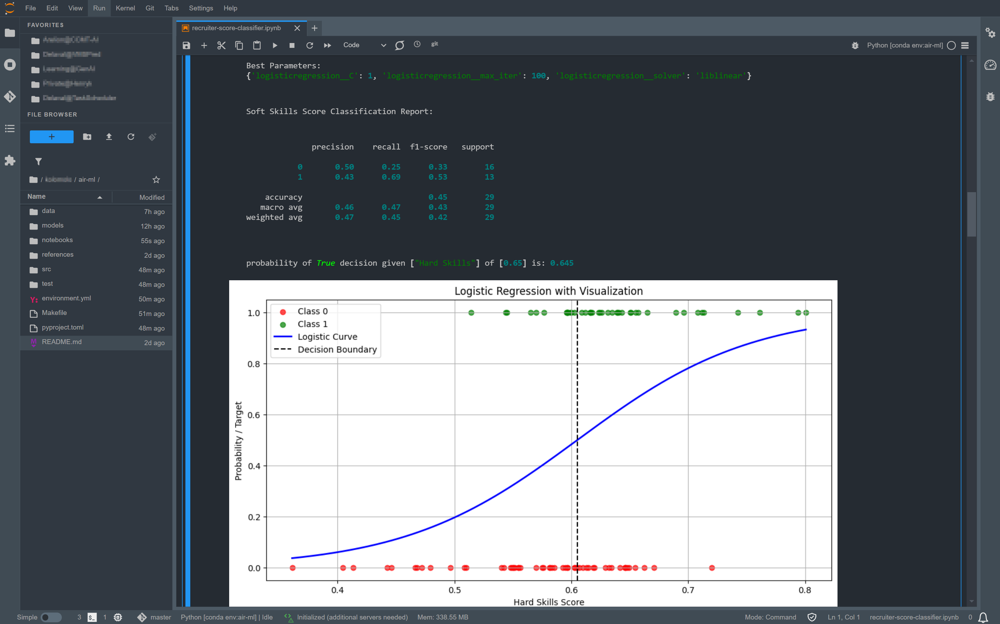

# JupyterLab for Data Science Platform
**Miniforge 3 + JupyterLab 4 for Data Science + TensorFlow (with GPU support) + Torch (with GPU support)**

This project provides a pre-packaged, pre-configured JupyterLab environment running on Miniconda with NVIDIA GPU support. It includes a curated set of data science packages, allowing you to start your data science projects with ease.

Jupyterlab, Tensorboard, Optuna, MLFlow and other services are running over **Traefik** reverse proxy that makes it possible to launch multiple environments without any port collisions. All services are available via distinct URLs

 - Jupyterlab: [https://localhost/stellars-jupyterlab-ds/jupyterlab](https://localhost/stellars-jupyterlab-ds/jupyterlab) to access Jupyterlab IDE
 - MLFlow: [https://localhost/stellars-jupyterlab-ds/mlflow](https://localhost/stellars-jupyterlab-ds/mlflow) to access MLFlow workbench
 - Tensorboard: [https://localhost/stellars-jupyterlab-ds/tensorboard](https://localhost/stellars-jupyterlab-ds/tensorboard) to access Tensorboard dashboard
 - Glances: [https://localhost/stellars-jupyterlab-ds/glances](https://localhost/stellars-jupyterlab-ds/glances) to access CPU + MEM + GPU monitor
 - Optuna: [https://localhost/stellars-jupyterlab-ds/optuna](https://localhost/stellars-jupyterlab-ds/optuna) to access Optuna dashboard (when running)





## Quickstart

Preferred method for running the container is with **docker compose**

### Docker Compose

1. download `compose.yml` or `compose-gpu.yml` file
2. run `docker compose -f docker-compose.yml up --no-build` command
3. open https://localhost/stellars-jupyterlab-ds/jupyterlab in your browser

### Multi User Deployment

We have recently created a convenient launcher for multi-user platform, see https://github.com/stellarshenson/stellars-jupyterlab-ds/tree/main/multi-user
- `start-lab-user.sh` - script that launches new environment for a new user
- `stop-lab-user.sh` - script that shuts user's environment down

### Docker

You can run the `stellars-jupyterlab-ds` container without `docker compose`, just with regular `docker`. 
Commands below will create a container with persistent home folder (settings), certs mount (with https certificates for security) and workspace (your projects). Use the commands below:

IMPORTANT: make sure you have docker host running (i.e. [Docker Desktop](https://www.docker.com/products/docker-desktop/)) 

**Without GPU support**
```
docker run -p 8888:8888 \
 -v stellars-jupyterlab-ds_home:/home \
 -v stellars-jupyterlab-ds_workspace:/home/lab/workspace \
 -v stellars-jupyterlab-ds_certs:/mnt/certs \
 --name lab \
 --hostname lab \
 stellars/stellars-jupyterlab-ds:latest
```

**With GPU support (NVIDIA)**
```
docker run -p 8888:8888 \
 -v stellars-jupyterlab-ds_home:/home \
 -v stellars-jupyterlab-ds_workspace:/home/lab/workspace \
 -v stellars-jupyterlab-ds_certs:/mnt/certs \
 -e GPU_SUPPORT_ENABLED=1 \
 --gpus all \
 --name lab-gpu \
 --hostname lab-gpu \
 stellars/stellars-jupyterlab-ds:latest
```

... and open https://localhost:8888 in your browser

## Key Features
- **JupyterLab Extensions:**
  - JupyterLab-Git extension
  - JupyterLab-LSP (Python) for enhanced autocompletion and code suggestions with documentation
  - Resource usage monitor

- **TensorBoard:**
  - TensorBoard server running on port `6006`, with logs stored in `/tmp/tf_logs` to monitor your ML/AI model training and neural network development

For a complete list of installed packages, please refer to the [packages manifest](https://github.com/stellarshenson/stellars-jupyterlab-ds/blob/main/build/conf/environment_base.yml), which is frequently updated to ensure you have access to the best tools for your development needs.

## About the Author
**Name:** Konrad Jelen (aka Stellars Henson)  
**Email:** konrad.jelen+github@gmail.com  
**LinkedIn:** [Konrad Jelen](https://www.linkedin.com/in/konradjelen/)

Entrepreneur, enterprise architect, and data science/machine learning practitioner with extensive software development and product management experience. Previously an experimental physicist with a strong background in physics, electronics, manufacturing, and science.

## Installation

To use this environment, Docker must be installed on your system. JupyterLab 4 is provided as a Docker container, ensuring complete isolation from your system's software.

**Docker Hub Repository:** [Stellars JupyterLab DS](https://hub.docker.com/repository/docker/stellars/stellars-jupyterlab-ds/general)

### Required Software
1. [Docker Desktop](https://www.docker.com/products/docker-desktop/) - Includes the `docker-compose` command necessary to run the container.
2. `docker-compose` - Installed automatically with Docker Desktop.

### Usage

1. **Pull the latest container image:**
   ```bash
   docker compose -f compose.yml pull
   ```

2. *(Optional)* **Build the image locally:**  
   Note that building the image locally may take approximately 1.5 hours.
   ```bash
   docker compose -f compose.yml build
   ```

3. **Start the container with your desired configuration:**
   - Standard non-CUDA container:
     ```bash
     docker compose -f compose.yml up
     ```
   - Standard CUDA container:
     ```bash
     docker compose -f compose.yml -f compose-gpu.yml up
     ```
   - Custom container configuration:
     ```bash
     docker compose -f local/your-custom-compose.yml up
     ```
   - Alternatively, use the provided `start.sh` or `start.bat` scripts.

**Quick Configuration Tips:**
- Use the `CONDA_DEFAULT_ENV` variable in your home `~/.profile` file to specify your default conda environment.
- Alternatively set `CONDA_DEFAULT_ENV` variable in `compose.yml` file 

## Default Settings
- **Work Directory:** `~/workspace`
- **Home Directory:** `/home/lab` (contains user settings)
- **JupyterLab Settings:** Stored in `/home/lab/.jupyter`
- **Volume Mapping:** With `docker compose`, both `home` and `workspace` directories are mounted as volumes. Thanks to this you can frequently update **stellars-jupyterlab-ds** container image without affecting your work
- **Root Access:** You have access to the local root account with `sudo` (password: `password`).
- **TensorBoard Logs Directory:** `/tmp/tensorboard`
- **Conda Environments:** 
  - `base` - basic machine learning tools and packages
  - `tensorflow` - latest stable `tensorflow` installed with NVIDIA CUDA GPU support
  - `torch` - latest pytorch environment with NVIDIA CUDA GPU support
  - `r_base` - environment equipped with R installation and jupyterlab kernel

**Tip:** You can change envionment using `conda activate env_name` command. You can also set default environment either by setting `CONDA_DEFAULT_ENV` in `compose.yml` file or in the `~/.profile` file in your home directory

**Tip:** You don't need to run `docker compose build` if you pull the image from Docker Hub. Running `docker compose up` for the first time will automatically use the pre-built package if available.

## Configuration Details

- **`build`:** Contains container build artifacts. Typically, you won't need to interact with this directory.
- **`project.env`:** Contains the project name, used for naming volumes and the Docker Compose project.

**Tip:** Modify the `/opt/workspace` entry in the `volumes:` section of the `docker-compose` files to map to a different project location on your filesystem.

## Platform Features
- **JupyterLab 4+** ([JupyterLab Homepage](https://jupyterlab.readthedocs.io/en/latest) for reference)
- **Extensions:** Git integration, autocompletion, and other useful tools.
- **Language Server Protocol (LSP):** For Python autocompletion.
- **Machine Learning Libraries:** Keras, TensorFlow, Scikit-learn, SciPy, NumPy.
- **Data Manipulation Libraries:** Pandas, Polars.
- **Visualization Libraries:** Matplotlib, Seaborn.
- **NVIDIA CUDA Support:** GPU-accelerated libraries like CuPy, cuDF, and TensorFlow with GPU support.
- **Miniconda:** With enhanced terminal support in JupyterLab.
- **Output Formats:** HTML and PDF (WebPDF) generation.
- **Memory Profiler:** Monitor resource usage.
- **Customizable File Mapping:** Easily map your filesystem's project folder to the container.
- **Persistent Settings:** Configurable files and folders for JupyterLab settings, AWS credentials, and Git settings.
- **Themes:** IntelliJ dark theme with medium contrast.
- **Favourites:** Quick access for projects.
- **Enhanced Terminal:** Includes `mc` and other useful tools.
- **TensorBoard:** Pre-configured and running on port 6006.
- **TensorFlow Visualization Extensions:** For improved model insights.

<!-- EOF -->

